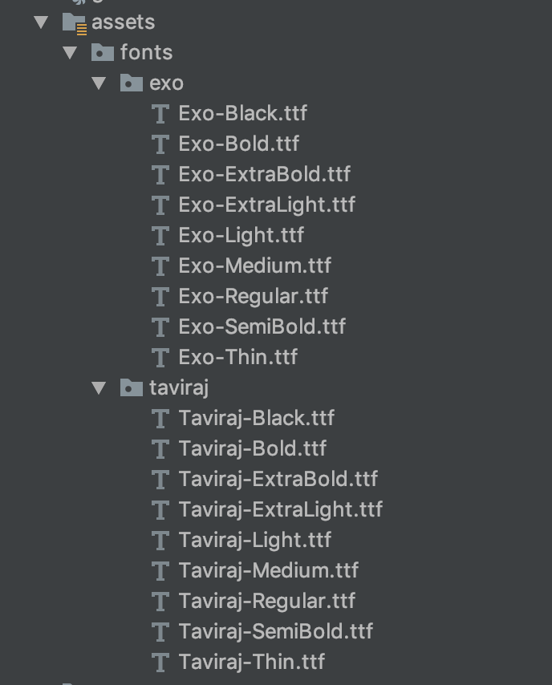

# Create and Distribute Android Libraries with Jitpack

In this tutorial, we will show you step by step how to create a library for Android and distribute it through Jitpack.

## Create Library
To create a library for Android and distribute it through Jitpack, do the following

### Step 1 - Create a new Android App

First thing you’ll need is a freshly created new Android Project, where you’ll be testing and later showcasing your new library.



### Step 2 - Create a new Android Library

Once your project is ready and running, you’ll have to add a new local library:

- Right-click your project new -> module and select ‘Android Library’


- Add the dependency to your app/build.gradle file:

```
compile project(':mycoollib')
```
- Modify your library and add your codes 

### Step 3 - Publish to Github

we need to upload our code to Github.

- First we’ll need to create an empty Github repository 

- Commit and push project to Github 

```
git init
git add .
git commit -m "initial commit"
git remote add origin {your_github_repository_url}
git push -u origin master
```

### Step 4 - Setup Jitpack
Jitpack will let you share your library with anyone just adding the dependency of your library to their projects

- Update your project/build.gradle file adding the following classpath:

```
buildscript { 
    dependencies { 
        classpath 'com.github.dcendents:android-maven-gradle-plugin:2.0'
```

- Update your library module/build.gradle Add this below the first apply plugin of your file

```
apply plugin: 'com.github.dcendents.android-maven' 
group='com.github.{your_github_user_name}'
```

- Create a release TAG in git

```
git tag {version} -m "description" 
git push origin {version}
```

- When all is setup and uploaded to Github, go to this jitpack url:
```
https://jitpack.io/#{your_github_user_name}/{your_repository_name}
```

### Step 5 - Create your library Readme File
Github automatically looks up for a file named ‘README.md’ at the root of your repository and displays it below. This file is important because it’s the entry point of any developer to your library and the first thing they’ll see when reaching your repository

- create README.md file
- add Installation and Usage instructions to readme file
- add Jitpack badge to readme file 
- commit and push changes to github
```
git add README.md
git commit -m "update readme"
git push -u origin master 
```

Finished, now you can use the library anywhere


## Update Library
If you modify your library and you want to update Library on Jitpack, do the following

### Step 1 - Update library version
- update version in module/build.gradle
- update version in readme

### Step 2 - Update your  Repository on Github
```
git add .
git commit -m "update"
git push -u origin master
```

### Step 3 - Tagging
```
git tag {version} -m "description"
git push origin {version}
```


[Refrence](https://medium.com/@zurche/create-and-distribute-your-own-android-library-after-reading-this-post-c3187a2a0691)


## Author

Mostafa Taghipour, mostafa@taghipour.me

## License

Copyright © 2019 Mostafa Taghipour. 

[LICENSE]: LICENSE
